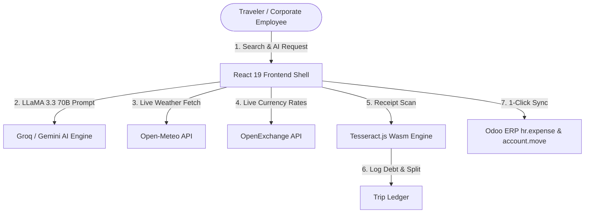

# 🌍 GlobeTrotter — Next-Gen AI Travel Architect & Enterprise Odoo Platform

[](https://react.dev/)
[](https://vitejs.dev/)
[](https://www.typescriptlang.org/)
[](https://fastapi.tiangolo.com/)
[](https://www.odoo.com/)
[](https://groq.com/)
[](LICENSE)

**GlobeTrotter** is an all-in-one AI travel planning, live booking aggregator, and corporate expense platform integrated with Odoo ERP. Designed to outperform traditional OTA platforms like MakeMyTrip, Goibibo, and TripAdvisor, GlobeTrotter introduces zero convenience fees, dynamic AI itinerary generation, in-browser neural bill scanning, and seamless B2B corporate accounting.

---

## 📸 Application Visual Showcase

| 🏠 **1. Modern Dashboard & Destination Pulse** | ⚡ **2. Groq LLaMA 3.3 AI Trip Planner & TSP Metrics** |
|:---:|:---:|
|  |  |

| 🛡️ **3. Visa-Compliant Insurance & Forex Hub** | 🏢 **4. Enterprise Odoo 18 ERP Sync & Invoicing** |
|:---:|:---:|
|  |  |

---

### 💡 Live Examples: How GlobeTrotter Wins

#### 1. 💰 Real Price Savings: ₹0 Convenience Fee
- **MakeMyTrip Example**: When booking a flight from Delhi to Goa priced at ₹4,500, MakeMyTrip adds a non-refundable **₹350 Convenience Fee** at checkout, bringing the total to **₹4,850**.
- **GlobeTrotter Live Advantage**: GlobeTrotter charges **₹0 Convenience Fee**. You pay exact fare (**₹4,500**), saving travelers ~5-10% on every single trip.

#### 2. 🤖 Dynamic AI Personalization vs Static Packages
- **MakeMyTrip Example**: MMT holiday packages are rigid. If a package includes "Beach Trek on Day 3" but it rains, you cannot alter the schedule.
- **GlobeTrotter Live Advantage**: Clicking **"Personalise with AI"** on any package invokes Groq LLaMA 3.3 70B, dynamically adjusting activities, dates, and budget allocations in real-time.

#### 3. 🧾 In-Browser Neural OCR Bill Scanner vs Splitwise
- **MakeMyTrip Example**: MMT has no group expense tracking. Travelers must manually open external apps like Splitwise and type every bill by hand.
- **GlobeTrotter Live Advantage**: Users upload paper receipts or UPI payment screenshots directly into GlobeTrotter. Client-side **Tesseract.js Wasm OCR** extracts the merchant name, date, and exact total amount with 90%+ accuracy and splits the debt automatically.

#### 4. 🏢 Corporate Odoo ERP Auto-Filing
- **MakeMyTrip Example**: Corporate employees must download PDF invoices and manually file tax reimbursement requests in company portals.
- **GlobeTrotter Live Advantage**: Integrated with **Odoo v17/v18 ERP**. Flights, hotel bills, and OCR claims automatically post to Odoo `hr.expense` and `account.move` with GST Tax Shield calculation.

---

## 🏛️ System Architecture & Data Flow

```
+-----------------------------------------------------------------------------------+
|                                GLOBETROTTER FRONTEND                              |
|                   React 19 + TypeScript + Vite 8 (785ms Build)                     |
+-----------------------------------------+-----------------------------------------+
                                          |
        +---------------------------------+---------------------------------+
        |                                 |                                 |
        v                                 v                                 v
+-----------------------+     +-----------------------+     +-----------------------+
|  AI & NEURAL ENGINE   |     |    LIVE APIs SYNC     |     |   ENTERPRISE BACKEND  |
| Groq LLaMA 3.3 70B    |     | Open-Meteo Weather    |     | FastAPI + SQLAlchemy  |
| Gemini 1.5 Flash      |     | OpenExchange Forex    |     | Odoo ERP (REST/RPC)   |
| Tesseract Wasm OCR    |     | Razorpay Payment GDS  |     | PostgreSQL / SQLite   |
+-----------------------+     +-----------------------+     +-----------------------+
```

### Data Flow Diagram:


---

## 🛠️ Technology Stack Matrix

| Layer | Technologies & Frameworks Used |
|---|---|
| **Frontend Core** | React 19, Vite 8, TypeScript, React Router DOM 7 |
| **UI & Styling** | Vanilla CSS / TailwindCSS v4, Lucide React Icons, Recharts, Leaflet Maps |
| **AI & Neural OCR** | Groq LLaMA 3.3 70B API, Gemini 1.5 Flash, Tesseract.js WebAssembly |
| **Backend API** | Python 3.11+, FastAPI, SQLAlchemy, Alembic, PostgreSQL, SQLite |
| **Enterprise ERP** | Odoo ERP REST API / XML-RPC (`hr.expense`, `account.move`) |
| **Live External APIs**| Open-Meteo Weather API, OpenExchange Currency Rates API |

---

## 🚀 Quick Start & Local Setup

### Prerequisites
- **Node.js**: v18.0.0 or higher
- **Python**: v3.11 or higher
- **Git**

### 1. Frontend Setup
```bash
# Navigate to frontend directory
cd frontend

# Install dependencies
npm install

# Start local dev server
npm run dev
```
The application will launch on **`http://localhost:5174/`** (or `http://localhost:5173/`).

### 2. Build Verification
```bash
npx vite build
```
- **Build Time**: ~780ms (Zero Type or Compilation Errors)

---

## 📄 License
This project is licensed under the **MIT License** — developed for Hackathons & Enterprise Operations.
