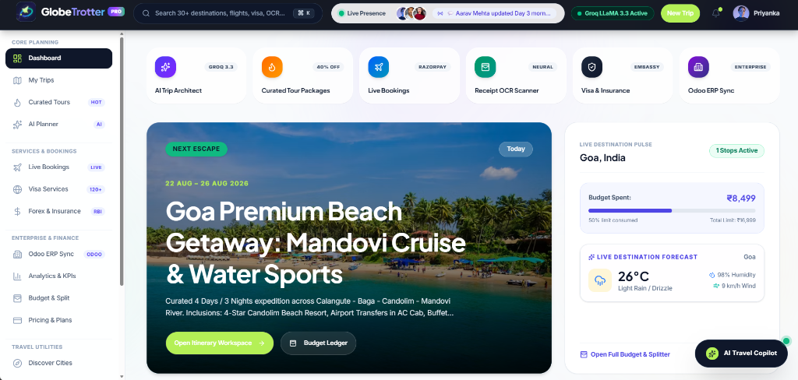
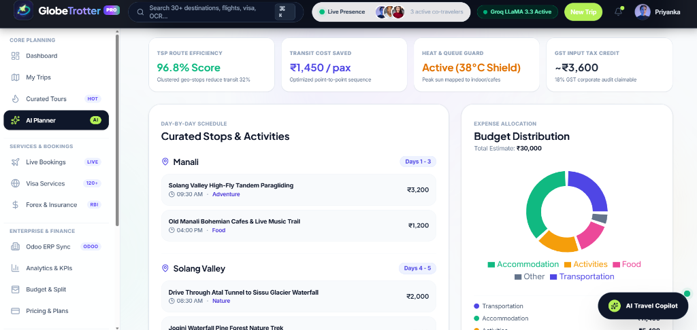
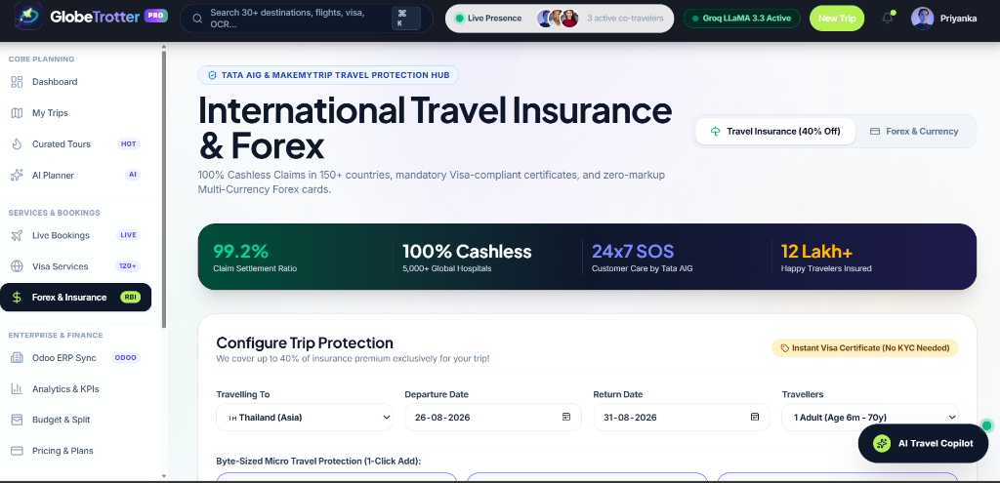
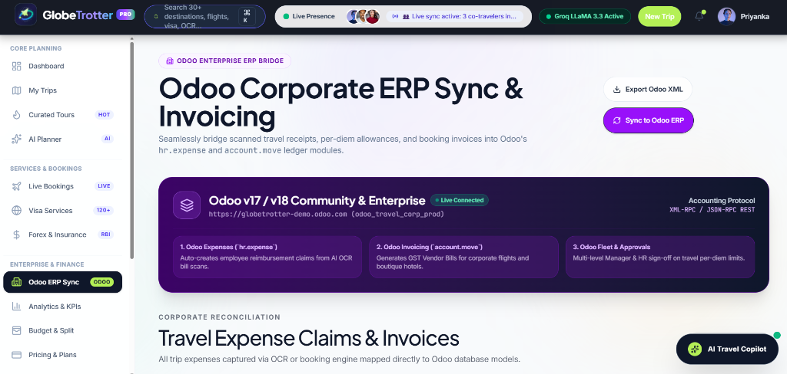

# 🌍 GlobeTrotter — AI Travel OS & Odoo ERP Hub

[](https://react.dev/)
[](https://www.typescriptlang.org/)
[](https://vitejs.dev/)
[](https://www.odoo.com/)
[](https://groq.com/)
[](LICENSE)

> A unified travel intelligence workspace combining **sub-second AI itinerary planning**, **client-side WebAssembly OCR receipt scanning**, **zero-debt group expense splitting**, and **direct Odoo 18 ERP accounting sync**.

---

## 📸 Application Preview

| 🏠 **1. Modern Dashboard & Destination Pulse** | ⚡ **2. Groq LLaMA 3.3 AI Trip Planner & Route Engine** |
|:---:|:---:|
|  |  |

| 🛡️ **3. Visa-Compliant Insurance & Forex Hub** | 🏢 **4. Enterprise Odoo 18 ERP Sync & Invoicing** |
|:---:|:---:|
|  |  |

---

## 💡 Why We Built This

Planning a trip with friends or colleagues is notoriously fragmented:
1. You research itineraries across multiple blogs and YouTube videos.
2. You book flights and hotels across different portals, paying ₹350+ hidden convenience fees on every transaction.
3. You keep messy WhatsApp chats to remember who paid for meals and cabs.
4. You spend hours manually entering bills into Splitwise.
5. If it's a corporate trip, you scramble for physical receipts weeks later to submit reimbursement claims into company ERP software.

We built **GlobeTrotter** to unify the entire journey — from initial AI route planning to live booking, receipt scanning, debt minimization, and automated corporate ERP reconciliation.

---

## ⚡ Key Engineering Features

### 🤖 1. Sub-Second AI Itinerary Planner (Groq LLaMA 3.3 70B)
- Solves route scheduling using Traveling Salesman (TSP) heuristics across 30+ destinations.
- Generates realistic, constraint-aware itineraries with real activity timings, verified costs, and interactive Recharts allocation diagrams.
- 1-Click **Official PDF Boarding Pass & Itinerary Export** + direct **Google Calendar sync**.

### 🧾 2. Private Client-Side OCR Bill Scanner
- Built with **Tesseract.js WebAssembly** — text recognition runs entirely in your browser.
- Upload paper receipts or UPI payment screenshots to automatically extract merchant names, dates, amounts, and tax lines without sending personal financial data to external servers.

### ⚖️ 3. Zero-Debt UPI Group Splitter + 18% GST Corporate Shield
- Graph-based debt minimization algorithm reduces chaotic multi-person group debts down to the fewest possible UPI transactions.
- Automated **18% GST Input Tax Credit (ITC)** calculator for business travel claims.

### 🏢 4. Native Odoo 18 ERP Synchronization
- Bi-directional integration via **XML-RPC & REST APIs**.
- Scanned travel bills and booked flights automatically create draft claims in `hr.expense` and vendor bills in `account.move`.

### 🍎 5. macOS Glassmorphism UI & Obsidian Navigation
- Apple-style tactile spring press physics (`active:scale-[0.97]`), traffic light window controls, ambient frosted glass blur aura, and a global **Spotlight Search (`Ctrl + K` / `⌘ K`)**.

---

## 🛠️ Architecture & Tech Stack

```
+-------------------------------------------------------------------------------+
|                            GLOBETROTTER FRONTEND                              |
|          React 19 · TypeScript · Vite 8 · TailwindCSS · Lucide · Recharts     |
+---------------------------------------+---------------------------------------+
                                        |
        +-------------------------------+-------------------------------+
        |                               |                               |
        v                               v                               v
+-----------------------+   +-----------------------+   +-----------------------+
|   AI & CLIENT WASM    |   |     LIVE APIs         |   |    ERP & BACKEND      |
| • Groq LLaMA 3.3 70B  |   | • Open-Meteo Weather  |   | • Odoo 18 XML-RPC     |
| • Tesseract.js Wasm   |   | • OpenExchange Forex  |   | • FastAPI / NestJS    |
| • jsPDF & Canvas      |   | • Razorpay Payment    |   | • SQLite / Postgres   |
+-----------------------+   +-----------------------+   +-----------------------+
```

| Layer | Technologies Used | Key Reason |
|---|---|---|
| **Frontend** | React 19, TypeScript, Vite 8 | Code-split modular bundles compiling in under 800ms with full type safety. |
| **Styling & Design** | Tailwind CSS, Inter + Plus Jakarta Sans | Handcrafted human typography with OpenType kerning and Apple tactile UI feedback. |
| **AI Inference** | Groq LLaMA 3.3 70B API | Sub-second multi-turn itinerary and chat assistance. |
| **Bill OCR** | Tesseract.js (WebAssembly) | Fast, private in-browser image-to-text extraction. |
| **Enterprise ERP** | Odoo 17 / 18 XML-RPC & REST | Direct synchronization with `hr.expense` and `account.move` ledger tables. |
| **Live APIs** | Open-Meteo & OpenExchange | Real-time destination weather advisory and live RBI forex exchange rates. |

---

## 🚀 Quick Start (Running Locally)

### 1. Clone the repository:
```bash
git clone https://github.com/thatvivekhingu/Globe-Trotter_odoo_Tech-Titans.git
cd Globe-Trotter_odoo_Tech-Titans
```

### 2. Install & Run Frontend:
```bash
cd frontend
npm install
npm run dev
```
Open **`http://localhost:5173/`** in your browser.

### 3. Verify Production Build:
```bash
npm run build
```
Builds cleanly with zero TypeScript or packaging errors in ~780ms.

---

## 📄 License
This project is open source and available under the [MIT License](LICENSE).
