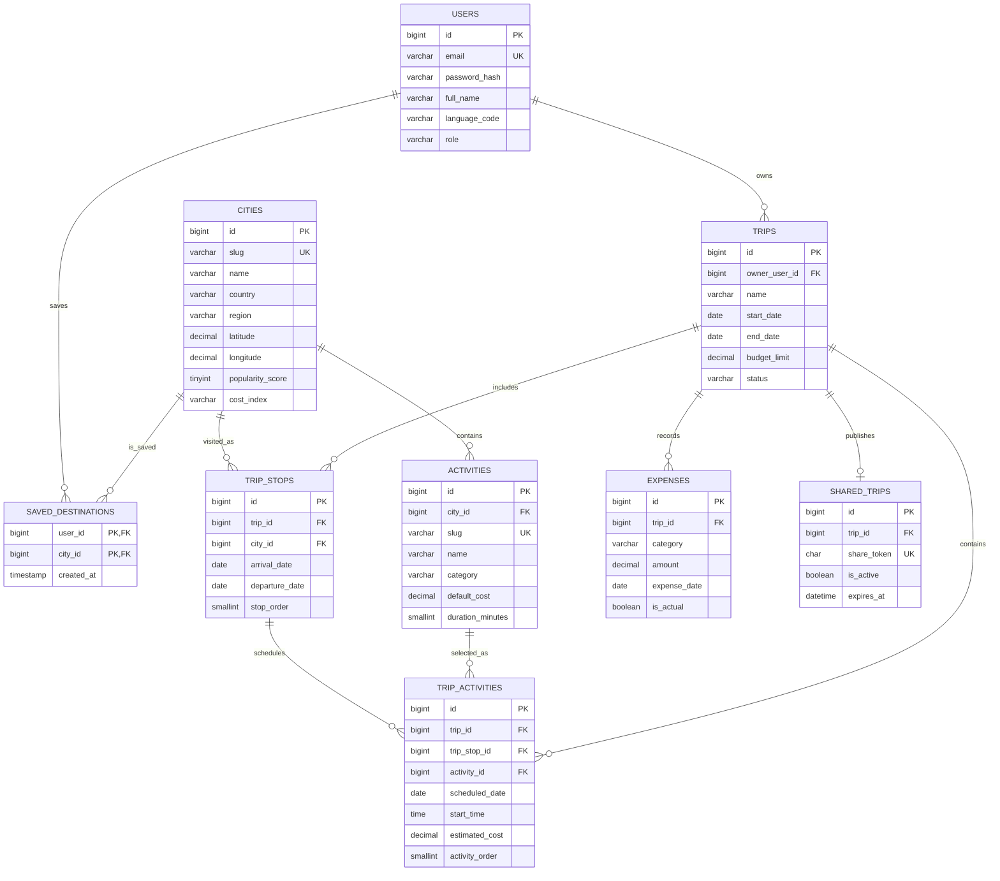

# TripWise Database Design

Phase 3 defines the relational MySQL foundation for TripWise. The schema keeps reusable destination and activity records separate from a user’s private itinerary selections.

## ER Relationship



## Relationship Decisions

### Users → Trips

A user owns many private trips. `trips.owner_user_id` is indexed and cascades when a user is removed. Every private trip query in the API must filter by the authenticated user ID in addition to the trip ID.

### Trips → Trip Stops → Cities

A trip stores ordered stops through `trip_stops`. A city is reusable reference data and is not duplicated for every trip. Arrival and departure dates live on the stop because the same city can be visited with different dates in different trips.

`(trip_id, stop_order)` is unique so a trip cannot have two stops occupying the same position.

### Cities → Activities

Activities are catalog records associated with a city. They hold default information such as category, duration, description, image, and default cost. The actual selected activity cost belongs to `trip_activities.estimated_cost`, allowing users to customize a catalog estimate for a particular trip.

### Trips → Trip Activities

`trip_activities` is the join/scheduling table between a trip stop and a catalog activity. It stores the assigned date, time, order, duration override, and trip-specific cost.

The composite foreign key `(trip_stop_id, trip_id)` points to the same trip-stop pair. This prevents an activity row from referencing a stop belonging to a different trip.

The database cannot validate that the activity’s city matches the stop’s city with a normal `CHECK` constraint. The Phase 4 service layer must enforce that business rule.

### Trips → Expenses

Expenses are manual trip-level records. Activity costs are calculated from `trip_activities`; transportation, accommodation, food, and other costs are represented by `expenses`. The budget service combines both sources by category.

`DECIMAL(12,2)` is used for all monetary values. Floating-point types are intentionally avoided.

### Trips → Shared Trips

A trip can have at most one active share record at a time. `share_token` is unique and is the only identifier exposed by the public URL. Public API schemas must select only trip content and must never return owner email, password hash, or private profile details.

### Users → Saved Destinations

The composite primary key prevents a user from saving the same city twice while allowing many users to save the same city.

## Integrity Rules

Enforced directly by MySQL:

- User email is unique.
- Share tokens are unique.
- Trip end date must be on or after the start date.
- Stop departure date must be on or after arrival date.
- Trip activity and expense amounts cannot be negative.
- Activity duration must be positive.
- Activity and expense categories are constrained to known values.
- Trip status, user role, language, and city cost index are constrained.
- Private child records cascade with their parent trip.
- Activities and cities cannot be deleted while referenced by catalog selections or stops.
- A trip activity cannot reference a stop belonging to another trip.

Enforced by the application/service layer in Phase 4:

- Stop dates must fall inside the parent trip dates.
- A trip activity date must fall inside its stop’s arrival/departure range.
- A trip activity’s catalog city must match its stop city.
- Only the trip owner can mutate private trip data.
- A share token must be active and unexpired before public access.
- Activity ordering and stop ordering must be normalized after mutations.

## Index Strategy

| Table | Index | Purpose |
|---|---|---|
| `users` | `uq_users_email` | Login lookup and uniqueness |
| `cities` | `idx_cities_name` | City search |
| `cities` | `idx_cities_country_region` | Country/region filtering |
| `cities` | `idx_cities_popularity` | Recommended destination sorting |
| `trips` | `idx_trips_owner` | Owner-scoped trip listing |
| `trips` | `idx_trips_owner_dates` | Upcoming/recent trip queries |
| `trip_stops` | `uq_trip_stop_order` | Stable route ordering |
| `trip_stops` | `idx_trip_stops_trip_dates` | Itinerary date lookup |
| `trip_activities` | `idx_trip_activities_trip_date` | Calendar/timeline queries |
| `trip_activities` | `uq_trip_activity_order` | Stable activity ordering |
| `activities` | `idx_activities_city_category` | Discovery filtering |
| `expenses` | `idx_expenses_trip_category` | Budget category aggregation |
| `shared_trips` | `uq_shared_trips_token` | Public share lookup |
| `saved_destinations` | `idx_saved_destinations_city` | Popular saved destination analytics |

## SQL Files

- [`backend/sql/001_initial_schema.sql`](../backend/sql/001_initial_schema.sql) — database, tables, constraints, relationships, and indexes
- [`backend/sql/002_seed_reference_data.sql`](../backend/sql/002_seed_reference_data.sql) — repeatable eight-city and activity catalog seed

## Local Setup

Create the schema:

```bash
mysql -u root -p < backend/sql/001_initial_schema.sql
```

Load reference data:

```bash
mysql -u root -p tripwise < backend/sql/002_seed_reference_data.sql
```

The seed script does not create a demo account or private trips. Password hashes and owner-scoped fixtures will be created by the FastAPI application once the authentication layer exists, avoiding plaintext or guessed credentials in SQL fixtures.

## Budget Aggregation Shape

The Phase 4 service can use a combined query similar to this shape:

```sql
SELECT category, SUM(amount) AS total
FROM (
  SELECT 'activities' AS category, estimated_cost AS amount
  FROM trip_activities
  WHERE trip_id = :trip_id

  UNION ALL

  SELECT category, amount
  FROM expenses
  WHERE trip_id = :trip_id
) AS costs
GROUP BY category;
```

The service should calculate total, cost per day, budget limit, and remaining amount using `Decimal` values and the parent trip’s date range.
